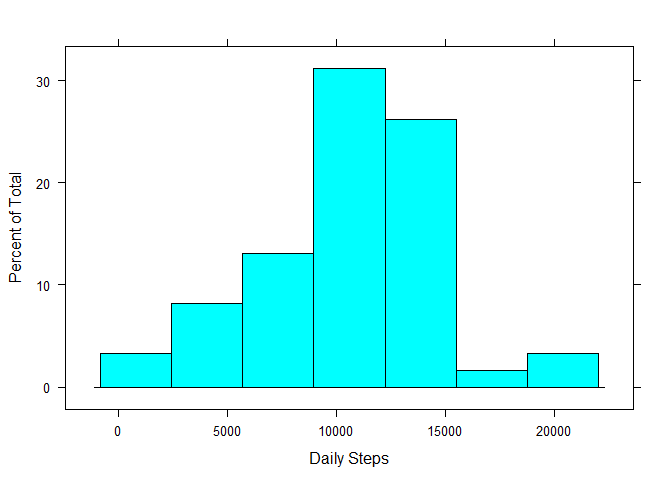

# Reproducible Research: Peer Assessment 1


```r
# Loading libraries used in the R chunks below.
require(dplyr, quietly = TRUE)
```

```
## 
## Attaching package: 'dplyr'
## 
## The following object is masked from 'package:stats':
## 
##     filter
## 
## The following objects are masked from 'package:base':
## 
##     intersect, setdiff, setequal, union
```

```r
require(lubridate, quietly = TRUE)
require(lattice, quietly = TRUE)
require(ggplot2, quietly = TRUE)
```

*Time stamp: Tue May 12 4:30:39 PM 2015.*

###Reproducible Data Project One

We study by graphical means different aspects of one subject's
daily step counts which were collected over a 61 day period. Statistically speaking there is little ability to generalize beyond this single subject, though there are observable patterns that may suggest some fruitful targets for additional investigation.

For example, the subject seems to walk most in the early morning hours and then  peaks again in the evening. It also appears that he is more active in the weekend than the weekday, but in a more diffuse way.

The fact there are days where he walks very little should be the target of additional investigation as either outliers or that this person works occasionally works from home and stays glued to his computer, etc.


####Analysis of Total Daily Steps
The analysis begins by reading the data file and creating a mutated data frame called actData. actData is augmented with a number of auxiliary columns, namely day, weekend, weeklySlot and hour which respectively denote day of week, weekend/weekday, hour, weekly time time slot. The interval column has been mutated so that it encodes the time of day as counted by minutes from 12:00 AM. For example, an interval value of 485 indicates a time window beginning at 8:05 AM.

We group by the date field to obtain the daily step counts over the 61 day trial.


```r
actData <- read.csv('activity.csv')
actData <- mutate(actData, hour=interval %/% 100, minute=interval %%100) %>%
    mutate(interval = 60 * hour + minute)  %>% 
    mutate(day = wday(as.Date(as.character(date), "%Y-%m-%d"), label=TRUE)) %>%
    mutate(weeklySlot = interval + ((as.integer(day) -2) %% 7) *1440) %>%
    mutate(weekend = ifelse(day %in% c("Sat","Sun"), "Weekend", "Weekday"))

dataByDay <- group_by(actData, date)
daySummaries <- summarize(dataByDay, dailyNa =sum(is.na(steps)), 
                          dailySteps =sum(steps))
histogram(daySummaries$dailySteps, na.rm = TRUE, xlab = "Daily Steps")
```

 

```r
summary(daySummaries$dailySteps, na.rm = TRUE)
```

```
##    Min. 1st Qu.  Median    Mean 3rd Qu.    Max.    NA's 
##      41    8841   10760   10770   13290   21190       8
```

####Analysis of Time Dependent Average Daily Activity 

We see from the graph below that activity peaks around 8:30 to 9:00 AM then sharply drops. Activity picks up again around noon and remains low until late afternoon around 4:30 PM. From that point activity is generally higher until about 7:30 to 8:00 PM.

```r
dataByInterval <-group_by(actData, interval)
z<-summarize(dataByInterval, avgSteps =mean(steps, na.rm =TRUE))
with(z, plot(interval, avgSteps, type ="l", xlab = "Minutes elapsed since the beginning of the day", ylab = "Avg Steps Per Time Window", xaxp = c(180, 1440, 7)))
```

 

```r
maxInterval <- z[z$avgSteps == max(z$avgSteps),]$interval
msg <- paste("The maximum average number of steps occurs at", maxInterval, "ie, around 8:35 AM")
cat(msg)
```

```
## The maximum average number of steps occurs at 515 ie, around 8:35 AM
```
####Imputing Missing Values
#####Calculate and report the total number of missing values in the dataset

```r
msg <- paste("The total number of rows missing values is", sum(is.na(actData$step)))
cat(msg)
```

```
## The total number of rows missing values is 2304
```
#####Strategy for filling in all of the missing values in the dataset
My strategy for replacing missing observations is by first computing the average of those time slots for that given weekday and time, for example, on October 1 at 12:05 AM there is NA steps. I propose to replace this missing value with the average over the data set of Sunday 12:05 AM values.

One may see from the following graph that weekend days inclusive of Friday, corresponding to 5760 through 10080, have a somewhat more active profile, giving credence to the idea of using averaged weekly time slots for imputing missing values.

```r
dataByDay <- group_by(actData,  weeklySlot)
dailyAvgByWeekSlot <- summarize(dataByDay, steps = mean(steps, na.rm = TRUE))
with(dailyAvgByWeekSlot, plot(weeklySlot, steps, type = "l", xlab = "Minutes elapsed since the beginning of the week", xaxp = c(1440, 10080, 6)))
```

 

#####Create a new dataset that replaces missing data filled with estimates

```r
#Ugly helper function.
SwapFunction <- function(i, fullTab, weekTab) {
    if (is.na(fullTab[i,]$steps)==FALSE){
        return (fullTab$steps[i])
    }
    else {
        index = (fullTab$weeklySlot[i] + 5)/5
        return ( weekTab$steps[index])
    }
}
#end ugly helper function

massagedSteps <- sapply(seq_along(actData$steps), 
    function(i){SwapFunction(i, actData, dailyAvgByWeekSlot)})
                                
massagedSteps = as.numeric(massagedSteps)
massagedAct <- mutate(actData, steps = massagedSteps)

dataByDay1 <- group_by(massagedAct, date)
daySummaries1 <- summarize(dataByDay1, dailyNa =sum(is.na(steps)), 
                          dailySteps =sum(steps))
```
By visual inspection we see that filling in the missing values has had a minor influence on the histogram of daily total activity. The mean, median, first quartile and third quartile statistics respectively changed 0.97, 2.42,  0.47, -3.61 percent.

```r
histogram(daySummaries1$dailySteps, na.rm = FALSE, xlab = "Daily Steps")
```

 

```r
summary(daySummaries1$dailySteps, na.rm = FALSE)
```

```
##    Min. 1st Qu.  Median    Mean 3rd Qu.    Max. 
##      41    8918   11020   10820   12810   21190
```
####Analysis of differences between weekdays and weekends
  
We see from the panel graphs computed by the code below that weekday activity
is more spiked in the early AM hours followed by less activity that rises slowly
to a secondary peak starting around 6:00 PM and ebbing off around 7:30 PM.

In contrast the weekend starts with a less dominant peak around 9:00 AM, followed by diminished activity but less so than during the weekday, and higher levels of activity throughout the day. Also the evening weekend hours from 6:00 to 9:00 are more sustainedly busy than those of the weekday.


```r
dataByWeekend <- group_by(massagedAct, weekend, interval)
daySummaries1 <- summarize(dataByWeekend, NumberOfSteps =mean(steps))
qplot(interval,NumberOfSteps, data = daySummaries1, geom="line",
      xlab = "Minutes elapsed since the beginning of the day") + 
    facet_grid(weekend~.) + theme(strip.text.y = element_text(angle=0)) + 
    scale_x_continuous(breaks = c(seq(180, 1440, by = 180)))
```

 
